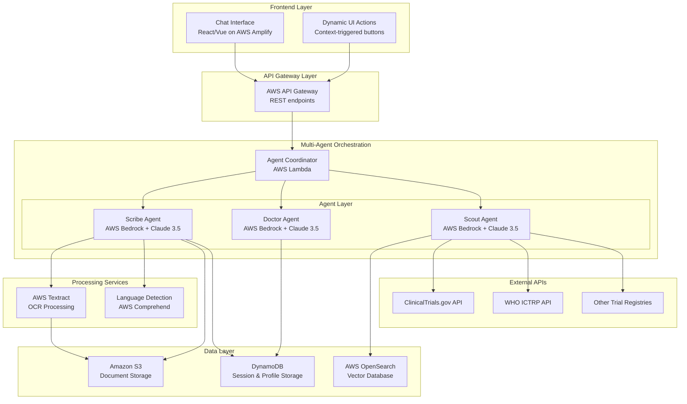

# Design Document: Trial-Scout

## Overview

Trial-Scout is a multi-agent AI system designed to help Indian patients discover relevant clinical trials through natural language conversation. The system addresses the "Missing Indian" problem in global medicine by providing culturally appropriate, multilingual access to clinical trial information with medical validation.

The architecture employs three specialized AI agents working in coordination:
- **Scribe Agent**: Handles patient intake, document processing, and multilingual communication
- **Doctor Agent**: Provides medical validation, safety checks, and information completeness verification
- **Scout Agent**: Discovers and matches clinical trials from multiple data sources

## Architecture

### High-Level System Architecture



### Agent Coordination Pattern

The system uses a **Supervisor Pattern** with the Agent Coordinator acting as the orchestrator:

1. **Sequential Processing**: Scribe → Doctor → Scout for initial patient intake
2. **Iterative Refinement**: Doctor can request additional information from Scribe
3. **Parallel Validation**: Doctor validates multiple trial matches simultaneously
4. **Event-Driven Communication**: Agents communicate through structured message passing

## Components and Interfaces

### Agent Coordinator

**Responsibilities:**
- Route messages between agents based on conversation state
- Maintain conversation context and patient profile state
- Handle error recovery and agent failure scenarios
- Coordinate dynamic UI action triggers

**Key Methods:**
```typescript
interface AgentCoordinator {
  processUserMessage(message: UserMessage): Promise<AgentResponse>
  routeToAgent(agentType: AgentType, context: ConversationContext): Promise<AgentResponse>
  triggerDynamicAction(actionType: string, context: any): Promise<UIAction>
  handleAgentError(error: AgentError, fallbackStrategy: string): Promise<AgentResponse>
}
```

### Scribe Agent

**Responsibilities:**
- Multilingual conversation handling (11 Indian languages + English)
- Document upload and OCR processing via AWS Textract
- Patient profile creation and standardization
- Dynamic UI action triggering for document uploads

**Core Capabilities:**
- Language detection using AWS Comprehend
- Medical terminology translation and validation
- Structured data extraction from unstructured text
- Cultural context awareness for Indian medical practices

**Key Interfaces:**
```typescript
interface ScribeAgent {
  processMessage(message: string, language?: string): Promise<ScribeResponse>
  processDocument(documentUrl: string): Promise<ExtractedData>
  createPatientProfile(conversationData: any[]): Promise<PatientProfile>
  triggerDocumentUpload(context: string): Promise<UIAction>
}

interface PatientProfile {
  demographics: Demographics
  medicalConditions: MedicalCondition[]
  currentMedications: Medication[]
  treatmentHistory: Treatment[]
  allergies: Allergy[]
  vitalSigns?: VitalSigns
  labResults?: LabResult[]
}
```

### Doctor Agent

**Responsibilities:**
- Medical safety validation and contraindication checking
- Information completeness assessment
- Clinical reasoning for trial suitability
- Coordination with Scribe for missing information

**Validation Process:**
1. **Profile Completeness Check**: Verify all required medical information is present
2. **Contraindication Analysis**: Check for drug interactions and medical conflicts
3. **Inclusion Criteria Validation**: Ensure patient meets trial requirements
4. **Information Gap Identification**: Request missing data through Scribe

**Key Interfaces:**
```typescript
interface DoctorAgent {
  validateTrialSafety(profile: PatientProfile, trial: TrialMatch): Promise<SafetyValidation>
  checkInformationCompleteness(profile: PatientProfile, requiredFields: string[]): Promise<CompletenessCheck>
  requestAdditionalInfo(missingFields: string[]): Promise<InfoRequest>
  performMedicalReasoning(profile: PatientProfile, trial: TrialMatch): Promise<MedicalAssessment>
}

interface SafetyValidation {
  status: 'PASS' | 'FAIL' | 'CONDITIONAL'
  contraindications: Contraindication[]
  recommendations: string[]
  confidence: number
}
```

### Scout Agent

**Responsibilities:**
- Multi-source clinical trial discovery
- Real-time API integration with external trial databases
- Vector similarity matching using AWS OpenSearch
- Trial ranking based on medical efficacy and accessibility

**Data Sources:**
- **Primary**: ClinicalTrials.gov API v2.0
- **Secondary**: WHO ICTRP aggregated data
- **Internal**: AWS OpenSearch vector database with curated Indian trial data
- **Tertiary**: Regional trial registries (CTRI India, EudraCT)

**Matching Algorithm:**
1. **Semantic Search**: Vector similarity on medical conditions and treatments
2. **Criteria Filtering**: Strict inclusion/exclusion criteria matching
3. **Geographic Prioritization**: Prefer accessible locations while prioritizing efficacy
4. **Recency Weighting**: Favor actively recruiting trials

**Key Interfaces:**
```typescript
interface ScoutAgent {
  searchTrials(profile: PatientProfile, searchCriteria: SearchCriteria): Promise<TrialMatch[]>
  fetchExternalTrials(query: TrialQuery): Promise<ExternalTrial[]>
  rankTrials(trials: TrialMatch[], profile: PatientProfile): Promise<RankedTrial[]>
  checkTrialStatus(trialId: string): Promise<TrialStatus>
}

interface TrialMatch {
  trialId: string
  title: string
  phase: string
  condition: string
  interventions: Intervention[]
  inclusionCriteria: string[]
  exclusionCriteria: string[]
  locations: Location[]
  contactInfo: ContactInfo
  matchScore: number
  accessibilityScore: number
}
```

## Data Models

### Core Data Structures

**Patient Profile Schema:**
```json
{
  "patientId": "string",
  "demographics": {
    "age": "number",
    "gender": "string",
    "location": "Location",
    "preferredLanguage": "string"
  },
  "medicalConditions": [
    {
      "condition": "string",
      "icd10Code": "string",
      "diagnosisDate": "date",
      "severity": "string",
      "status": "active|resolved|chronic"
    }
  ],
  "currentMedications": [
    {
      "name": "string",
      "dosage": "string",
      "frequency": "string",
      "startDate": "date",
      "prescribedFor": "string"
    }
  ],
  "treatmentHistory": [
    {
      "treatment": "string",
      "startDate": "date",
      "endDate": "date",
      "outcome": "string",
      "sideEffects": "string[]"
    }
  ],
  "allergies": [
    {
      "allergen": "string",
      "reaction": "string",
      "severity": "mild|moderate|severe"
    }
  ]
}
```

**Trial Database Schema:**
```json
{
  "trialId": "string",
  "nctId": "string",
  "title": "string",
  "briefSummary": "string",
  "detailedDescription": "string",
  "phase": "string",
  "studyType": "string",
  "primaryPurpose": "string",
  "interventions": [
    {
      "type": "drug|device|procedure|behavioral",
      "name": "string",
      "description": "string"
    }
  ],
  "conditions": [
    {
      "name": "string",
      "meshTerm": "string"
    }
  ],
  "eligibility": {
    "minimumAge": "string",
    "maximumAge": "string",
    "gender": "string",
    "inclusionCriteria": "string[]",
    "exclusionCriteria": "string[]"
  },
  "locations": [
    {
      "facility": "string",
      "city": "string",
      "state": "string",
      "country": "string",
      "status": "recruiting|not_recruiting|completed",
      "contactInfo": "ContactInfo"
    }
  ],
  "vectorEmbedding": "number[]"
}
```

### Database Design

**DynamoDB Tables:**
- **Conversations**: Session management and conversation history
- **PatientProfiles**: Standardized patient medical profiles
- **TrialMatches**: Cached trial matches with validation results
- **UserPreferences**: Language and notification preferences

**OpenSearch Indices:**
- **trials-index**: Vector embeddings of trial descriptions and criteria
- **conditions-index**: Medical condition synonyms and ICD-10 mappings
- **medications-index**: Drug interaction and contraindication data

## Correctness Properties

*A property is a characteristic or behavior that should hold true across all valid executions of a system—essentially, a formal statement about what the system should do. Properties serve as the bridge between human-readable specifications and machine-verifiable correctness guarantees.*

### Property 1: Multilingual Communication Consistency
*For any* user input in a supported language (Hindi, Marathi, Tamil, Telugu, Bengali, Gujarati, Kannada, Malayalam, Punjabi, Odia, Hinglish, English), the Scribe Agent should detect the language correctly and respond in the same language while maintaining medical terminology accuracy.
**Validates: Requirements 1.1, 1.2, 1.3**

### Property 2: Document Processing Workflow Completeness  
*For any* uploaded medical document (PDF, image, or scanned document), the system should successfully extract text via Textract, convert it to structured medical information, and integrate it into the Patient Profile.
**Validates: Requirements 2.2, 2.3, 2.4, 2.5**

### Property 3: Dynamic UI Action Triggering
*For any* conversation where a user mentions having a document or medical record, the system should trigger the appropriate Dynamic UI Action button for document upload.
**Validates: Requirements 2.1, 6.4**

### Property 4: Patient Profile Schema Compliance
*For any* patient information collected through conversation or document processing, the resulting Patient Profile should validate against the defined JSON schema and include all required fields (medical conditions, medications, treatment history, demographics).
**Validates: Requirements 3.1, 3.2, 3.4**

### Property 5: Patient Profile Data Consistency
*For any* update operation on a Patient Profile, the system should maintain data consistency across all profile fields without corruption or loss of existing information.
**Validates: Requirements 3.3**

### Property 6: Medical Safety Validation Completeness
*For any* Trial Match and Patient Profile combination, the Doctor Agent should evaluate all relevant medical factors (current medications, conditions, treatment protocols) and generate appropriate Safety Flags with reasoning.
**Validates: Requirements 4.1, 4.2**

### Property 7: Information Gathering Hierarchy
*For any* scenario where additional patient information is needed, the Doctor Agent should follow the correct hierarchy: check Patient Profile first, then request Scribe Agent to check conversation context, then direct patient questioning if information is still missing.
**Validates: Requirements 4.3, 4.4, 4.5**

### Property 8: Safety Flag Generation Accuracy
*For any* medical validation scenario, when contraindications are detected the system should return "FAIL" with detailed reasoning, and when no contraindications exist the system should return "PASS".
**Validates: Requirements 4.6, 4.7**

### Property 9: Dual-Source Trial Discovery
*For any* trial search request, the Scout Agent should query both the internal AWS OpenSearch database and external clinical trial APIs to ensure comprehensive coverage.
**Validates: Requirements 5.1, 5.5**

### Property 10: Medical Efficacy Prioritization
*For any* set of trial results where geographic convenience conflicts with medical efficacy, the system should rank trials prioritizing medical efficacy and match quality over geographic factors.
**Validates: Requirements 5.2**

### Property 11: Inclusion Criteria Filtering
*For any* patient profile and set of potential trials, the Scout Agent should only return trials where the patient meets all strict inclusion criteria.
**Validates: Requirements 5.3**

### Property 12: Trial Result Completeness
*For any* trial search results, each returned trial should include all required information: participation requirements, contact information, location details, and intervention descriptions.
**Validates: Requirements 5.4**

### Property 13: Session Persistence
*For any* user conversation, the system should maintain conversation history across sessions and allow users to access previous conversations with preserved context and state.
**Validates: Requirements 7.1, 7.3, 7.4**

### Property 14: Agent Communication Workflow
*For any* complete patient workflow, when intake is complete the Scribe Agent should pass the Patient Profile to downstream agents, the Scout Agent should receive patient information and return Trial Matches, and the Doctor Agent should receive both Patient Profile and Trial Match data for validation.
**Validates: Requirements 8.1, 8.2, 8.3**

### Property 15: Integrated Result Presentation
*For any* completed multi-agent workflow, the system should present integrated results to the user combining intake, matching, and validation outcomes.
**Validates: Requirements 8.4**

### Property 16: Agent Communication Error Handling
*For any* agent communication failure scenario, the system should handle failures gracefully and provide appropriate error messages to the user.
**Validates: Requirements 8.5**

### Property 17: Data Persistence Round-Trip
*For any* document uploaded or patient profile created, the data should be stored securely and retrievable in subsequent sessions with complete data integrity maintained.
**Validates: Requirements 9.1, 9.2, 9.3**

### Property 18: External API Integration with Fallback
*For any* trial search operation, the Scout Agent should attempt external API integration, and when external APIs are unavailable, gracefully fall back to the internal OpenSearch database.
**Validates: Requirements 10.1, 10.2**

### Property 19: API Response Normalization
*For any* external API response received, the Scout Agent should parse and normalize the data into consistent internal formats regardless of the source API structure.
**Validates: Requirements 10.3**

### Property 20: API Rate Limit Handling
*For any* external API interaction, the system should handle rate limits and authentication requirements appropriately without causing system failures.
**Validates: Requirements 10.4**

### Property 21: Real-Time Data Prioritization
*For any* scenario where both cached and real-time trial data are available, the system should prioritize real-time API results over stale cached data.
**Validates: Requirements 10.5**

## Error Handling

### Error Categories and Strategies

**1. Agent Communication Failures**
- **Timeout Handling**: 30-second timeout for agent responses with automatic retry
- **Fallback Strategies**: Graceful degradation to single-agent mode when coordination fails
- **User Communication**: Clear error messages explaining system limitations

**2. External API Failures**
- **Circuit Breaker Pattern**: Temporary disable failing APIs after consecutive failures
- **Fallback Data Sources**: Automatic fallback to cached OpenSearch data
- **Retry Logic**: Exponential backoff for transient failures

**3. Document Processing Errors**
- **OCR Failure Handling**: Manual text input option when Textract fails
- **Format Validation**: Clear error messages for unsupported file formats
- **Size Limitations**: Graceful handling of oversized documents with compression suggestions

**4. Language Processing Errors**
- **Language Detection Fallback**: Default to English when detection fails
- **Translation Validation**: Medical term verification against known dictionaries
- **Cultural Context Errors**: Fallback to standard medical terminology

**5. Data Validation Errors**
- **Schema Validation**: Detailed error messages for profile validation failures
- **Medical Data Consistency**: Automatic correction suggestions for conflicting information
- **Privacy Compliance**: Automatic data sanitization for compliance violations

### Error Recovery Mechanisms

**Conversation State Recovery:**
- Automatic conversation state checkpointing every 5 interactions
- Recovery from last valid state on system errors
- User notification of recovered state with option to restart

**Data Integrity Protection:**
- Transaction-based profile updates with rollback capability
- Duplicate detection and merging for repeated information
- Audit logging for all data modifications

## Testing Strategy

### Dual Testing Approach

The testing strategy employs both unit testing and property-based testing to ensure comprehensive coverage:

**Unit Tests** focus on:
- Specific examples of multilingual conversations
- Edge cases in document processing (corrupted files, unusual formats)
- Integration points between agents
- Error conditions and recovery scenarios
- UI component behavior and dynamic action triggering

**Property-Based Tests** focus on:
- Universal properties that hold across all inputs
- Comprehensive input coverage through randomization
- Agent coordination workflows across various scenarios
- Data consistency and integrity across operations

### Property-Based Testing Configuration

**Framework**: Use Hypothesis (Python) or fast-check (TypeScript) for property-based testing
**Test Configuration**: Minimum 100 iterations per property test
**Tagging**: Each property test references its design document property

**Example Property Test Tags:**
- **Feature: trial-scout, Property 1**: Multilingual Communication Consistency
- **Feature: trial-scout, Property 4**: Patient Profile Schema Compliance
- **Feature: trial-scout, Property 9**: Dual-Source Trial Discovery

### Integration Testing Strategy

**Multi-Agent Workflow Tests:**
- End-to-end patient journey from intake to trial recommendations
- Agent handoff scenarios with various patient complexity levels
- Error propagation and recovery across agent boundaries

**External API Integration Tests:**
- Mock external APIs for consistent testing
- Rate limit simulation and fallback testing
- Data format variation testing across different trial registries

**Performance Testing:**
- Concurrent user conversation handling
- Large document processing performance
- Vector search performance with large trial databases
- Agent response time under load

### Security and Compliance Testing

**Data Protection Tests:**
- HIPAA compliance validation for medical data handling
- Encryption verification for data at rest and in transit
- Access control testing for patient profile data

**Privacy Testing:**
- Data anonymization verification
- Consent management workflow testing
- Data retention policy compliance testing